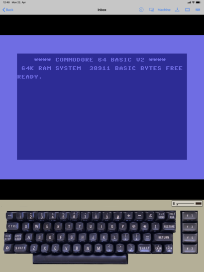

## A Commodore 64 Emulator for iPad.
## Almost Like the Real Thing.

C64 is an open source emulator for the 8 bit home computer [Commodore 64](https://en.wikipedia.org/wiki/Commodore_64). It is based on [Vice](http://vice-emu.sourceforge.net), which provices accurate emulation of many hardware variants and peripherals.

It aims to approximate the feeling of using actual hardware: 
- Rather than configuring abstract settings, you select hardware components.
- The software keyboard is a faccimile of the original, reflecting the different existing styles.
- Even the noise of the disk drive is emulated.

The **Library** section offers a way to organize a large collection of games, demos and programs. The emulated hardware can be customized for each entry.

The **Inbox** provides a place to quickly try new programs. You can easily move the ones you want to keep to the library.

**Tools** mode allows attaching a cartridge like Action Replay or Final Cartridge and a collection of disks with your favorite tools, to help you dig into the programs, like back in the day.

### Contact

Visit the website [spiderlab.at/c64](http://spiderlab.at/c64/) for screenshots.

The authors can be contacted at c64@spiderlab.at.

### Installing

Since emulators where users can add their own programs are not allowed in the App Store, you will have to install it yourself. You will need Xcode and a developer certificate.

You can build it from source yourself. C64 has no external dependencies. 

Or you can use [iOS App Signer](https://dantheman827.github.io/ios-app-signer/) to install a pre-built binary release (`.ipa` file).
